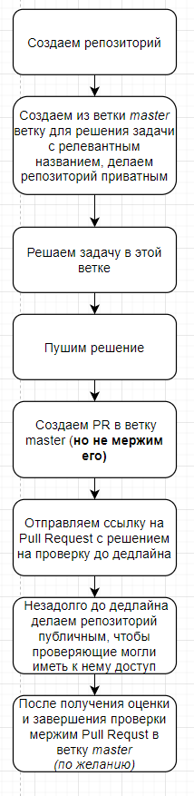
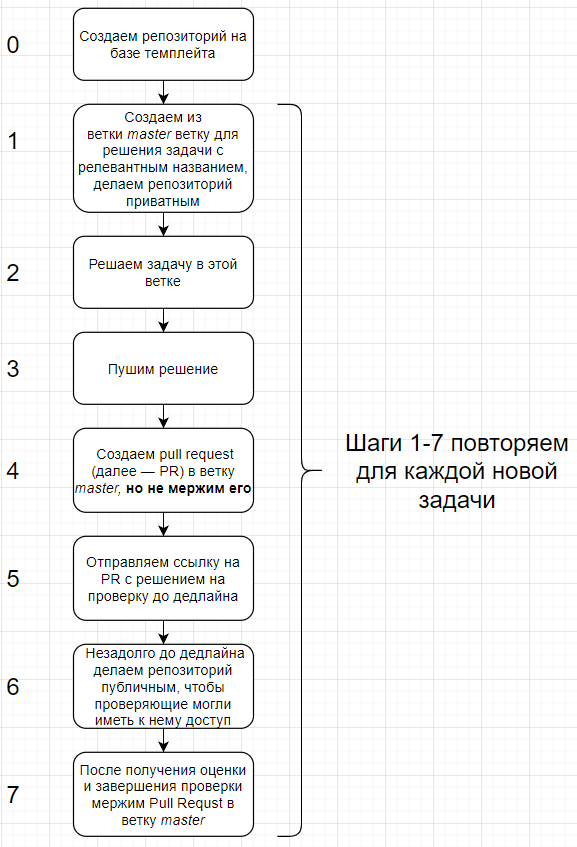

# RS School NodeJS course

You can generate a new repository with the same directory structure and files as the [template repository](https://github.com/rolling-scopes-school/nodejs-course-template) using GitHub article: [ Creating a repository from a template](https://help.github.com/en/github/creating-cloning-and-archiving-repositories/creating-a-repository-from-a-template).

**N.B**. Tasks for which the field *"Execute in"* wrirtten "template" should be implemented using the template, others - in the student's private repository.

---

## Tasks

### Task 1. Caesar cipher CLI tool

* Execute in: **private repository**
* [Description](./descriptions/caesar-cipher-cli-tool.md)
* [Cross-check criteria](./cross-check/caesar-cipher-cli-tool.md)

### Task 2. Express REST service

* Execute in: **template**
* [Description](./descriptions/express-rest-service.md)
* [Cross-check criteria](./cross-check/express-rest-service.md)

### Task 3. Debug in Node.js

* Execute in: **private repository**
* [Description](./descriptions/debug-nodejs.md)
* [Cross-check criteria](./cross-check/debug-nodejs.md)

### Task 4. Typescript basics

* Execute in: **template**
* [Description](./descriptions/typescript-basics.md)
* [Cross-check criteria](./cross-check/typescript-basics.md)

### Task 5. Logging & Error Handling

* Execute in: **template**
* [Description](./descriptions/logging-error-handling.md)
* [Cross-check criteria](./cross-check/logging-error-handling.md)

---

## Tasks execution schemas

### Execution in private repository



### Execution in repository created from template



## Hints

>  ### **How to get update from [template](https://github.com/rolling-scopes-school/nodejs-course-template/tree/master)**
>  1. Set VSCode as a default GIT editor (it's not mandatory)
>    ```bash
>      git config --global core.editor "code --wait"
>    ```
>  2. Commit current changes
>  3. Add template as the remote repository
>    ```bash
>      git remote add template https://github.com/rolling-scopes-school/nodejs-course-template.git
>    ```
>  4. Apply changes from template
>    ```bash
>      git pull template master --allow-unrelated-histories
>    ```
>  5. Apply all your changes
>    ```bash
>      git checkout --ours ':!node_modules'
>    ```
>  6. Apply all changes
>    ```bash
>      git checkout --theirs .
>    ```
>  7. Save changes
>    ```bash
>      git add .
>    ```
>  8. Continue merge
>    ```bash
>      git commit
>    ```
>  9. Close VSCode tab with commit message. If  default editor wasn't changed - quit VIM via `:qa`