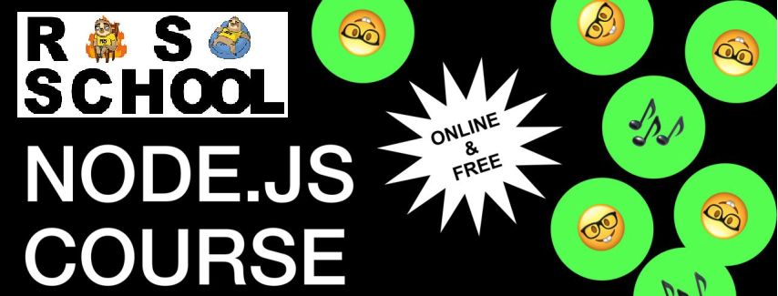

# Welcome to the Rolling Scopes School Node.js course!

**N.B!**. Tasks for which the field *"Execute in"* written "template" should be implemented using the template, others - in the student's private repository.

---

## Tasks

### Task 1. Ciphering CLI tool

* Execute in: **private repository**
* [Description](./descriptions/ciphering-cli-tool.md)
* [Cross-check criteria](./cross-check/ciphering-cli-tool.md)

### Task 2. Testing

* Execute in: **private repository (from 1st task)**
* [Description](./descriptions/testing.md)
* [Cross-check criteria](./cross-check/testing.md)

### Task 3. Simple CRUD API

* Execute in: **private repository**
* [Description](./descriptions/simple-crud-api.md)
* [Cross-check criteria](./cross-check/simple-crud-api.md)

### Task 4. REST Service

* Execute in: **template**
* [Description](./descriptions/rest-service.md)
* [Cross-check criteria](./cross-check/rest-service.md)

### Task 5. Typescript basics

* Execute in: **template**
* [Description](./descriptions/typescript-basics.md)
* [Cross-check criteria](./cross-check/typescript-basics.md)

### Task 6. Logging & Error Handling

* Execute in: **template**
* [Description](./descriptions/logging-error-handling.md)
* [Cross-check criteria](./cross-check/logging-error-handling.md)