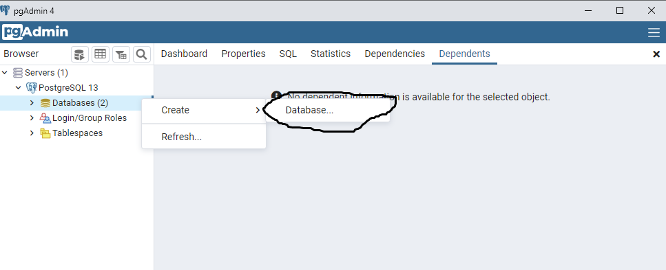
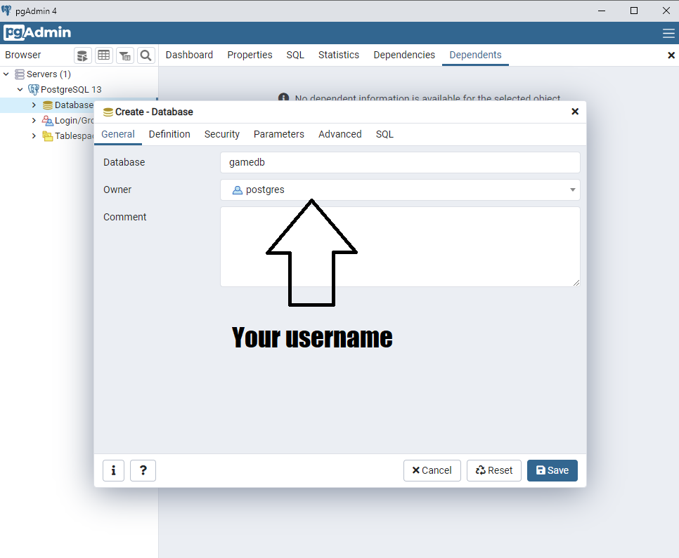
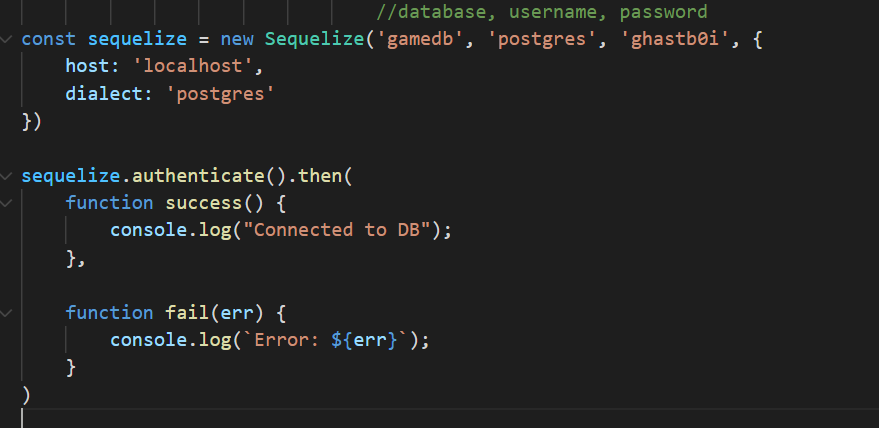
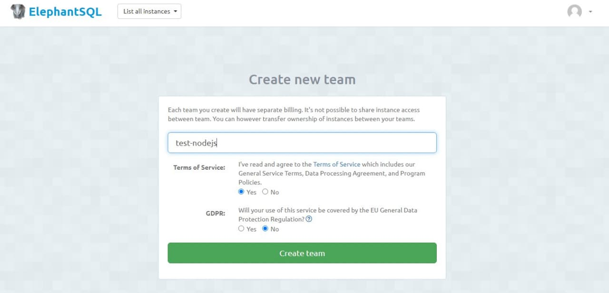
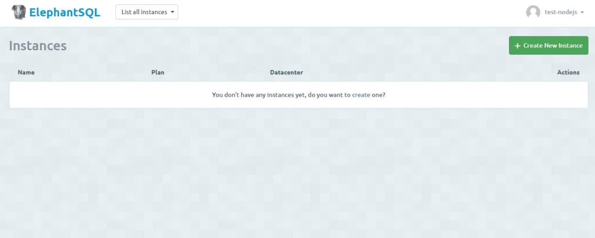
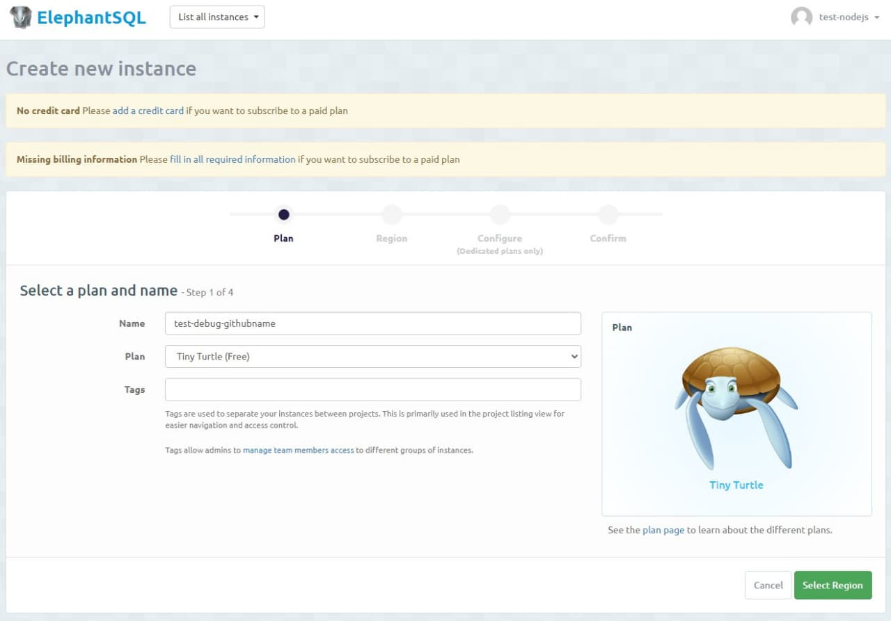
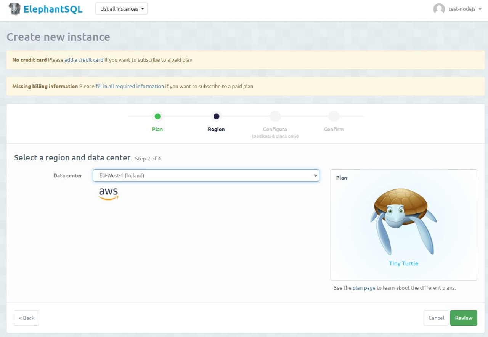
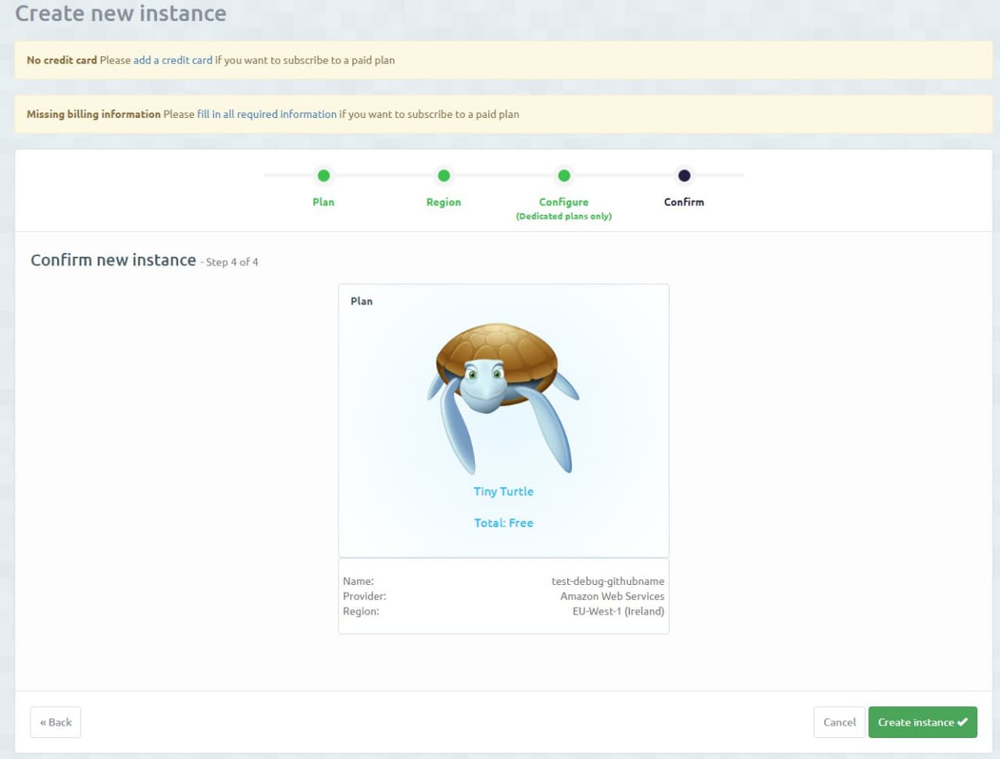
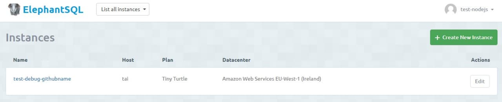
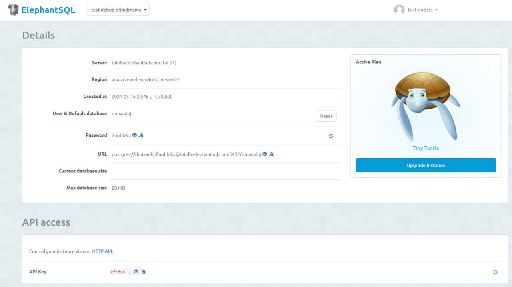

# Debug in Node.js

For this task you will use [this](https://github.com/AlreadyBored/broken-app) template repository. You have to create repository from that repo and send solution into it.

## Prerequisites

1. Install [Postgres](https://www.postgresql.org/download/) (contains **pgAdmin4**)  
2. Postgres should work on **localhost**, on **5433 port**  
3. Create user  
4. Run **pgAdmin4**  
5. Create database with name `gamedb`  
  
  
6. In file `db.js` change `username` and `login` strings to yours (**DO NOT COMMIT THIS**)  
  
7. Install dependencies (`npm i`)  
8. Run application via `npm run start`  

## Alternative way to use Postgres (via ElephantSQL API)

1. Go to [ElephantSQL](https://www.elephantsql.com/) website and register

2. Use any team name, agree with terms of service check that you don't need to follow GDPR  

3. Press button "Create new Instance"  

4. Give instance name & select free plan ("Tiny turtle")  

5. Choose region AWS eu-west-1 (or eu-central-1)  

6. Confirm creation of the instance  

7. Click on the instance to see details  

8. In the details window necessary properties are:
- server (host)
- user & default database
- password  

(alternatively - use URL).  
9. Install `donenv` package ([some info](https://dev.to/numtostr/environment-variables-in-node-js-the-right-way-15ad)) and in `.env` file (should be in root) set following variables:
```bash
DB_HOST=tai.db.elephantsql.com
DB=yourdatabasename
DB_USER=yourusername
DB_PASSWORD=yourpassword
```
10. `db.js` file beginning should look like this:
```js  
const Sequelize = require('sequelize');
require('dotenv').config();

const sequelize = new Sequelize(process.env.DB, process.env.DB_USER, process.env.DB_PASSWORD, {
    host: process.env.DB_HOST,
    dialect: 'postgres'
})
```

---

**DO NOT COMMIT .env file! (add it into .gitignore)**

Your task is to find at least **5 compilation errors** and **5 logic errors** using the debugging tools.

You need fix them and make the broken application workable.

An additional task is to refactor the repository using modern Javascript syntax and fix codestyle issues.